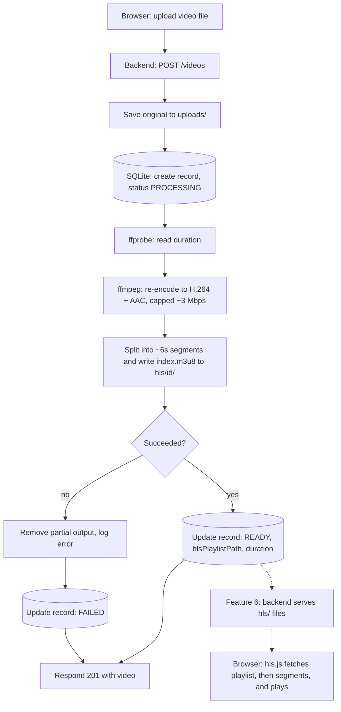

# Why we transcode uploads to HLS

An uploaded video (a phone `.mov`, a screen-recorded `.mkv`, a camera `.mp4`) is
built for capture and storage, not for streaming to a browser. This project turns
each upload into HLS (HTTP Live Streaming) before anyone watches it. This page
explains why, and how the pipeline fits together.

## The problem with playing the original

| Issue | What happens with the raw upload |
| --- | --- |
| **Codec and container support** | Browsers reliably play H.264 video with AAC audio. Phones often record HEVC (H.265), and containers like `.mkv` are not broadly supported in `<video>`. The file may simply not play. |
| **Bitrate** | Camera files are often 10-50+ Mbps. Streaming that over a normal connection stalls. |
| **Start and seek** | A single large file is fetched with byte-range requests. Whether playback can start quickly depends on how the file was written (for example, an MP4 with its index at the end is slow to start). |
| **Unpredictable input** | Every upload has a different resolution, frame rate, and codec. Serving them as-is means unpredictable playback. |

An upload that happens to be H.264/AAC MP4 may play as-is. Transcoding makes that
the rule instead of luck.

## What transcoding gives us

FFmpeg re-encodes the original into one known-good shape, then cuts it into pieces:

- **H.264 video + AAC audio**, which browsers support.
- **Capped bitrate (~2-3 Mbps)**, so playback fits ordinary connections.
- **Source resolution** is kept. Only dimensions are rounded to even numbers, which H.264 requires.
- **~6 second segments** (`segment_000.ts`, `segment_001.ts`, ...) listed in a **playlist** (`index.m3u8`).

The player downloads the playlist, then fetches segments one at a time. Playback
starts after the first segment, seeking jumps to the right segment, and later
features (adaptive bitrate, CDN) build on the same format.

HLS is played in the browser by [hls.js](https://github.com/video-dev/hls.js)
(Safari can play it natively). That is feature 6.

## Why it runs before playback

Transcoding is slow (it can take about as long as the video itself, or longer),
so a video is not watchable at upload time. That is why every video has a status:

- `PROCESSING`: stored, transcode in progress
- `READY`: HLS output exists and can be played
- `FAILED`: the file could not be transcoded (corrupt, unsupported, FFmpeg error)

In feature 5 the transcode runs inside the upload request, so the request waits.
Feature 7 moves it to a background queue so upload returns immediately.

## The flow



Solid arrows are built in feature 5. Dashed arrows are playback, built in feature 6.

## What the output looks like

```text
backend/
  uploads/
    <uuid>.mov                 <- original, kept as-is
  hls/
    <videoId>/
      index.m3u8               <- playlist: ordered list of segments
      segment_000.ts           <- ~6s each
      segment_001.ts
      ...
```

## Related

- Spec: [current-feature.md](../blueprint/context/current-feature.md) (feature 5)
- Build plan: [build-plan.md](../blueprint/build-plan.md)
